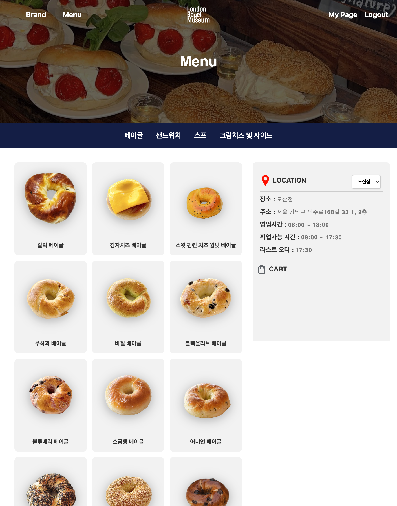
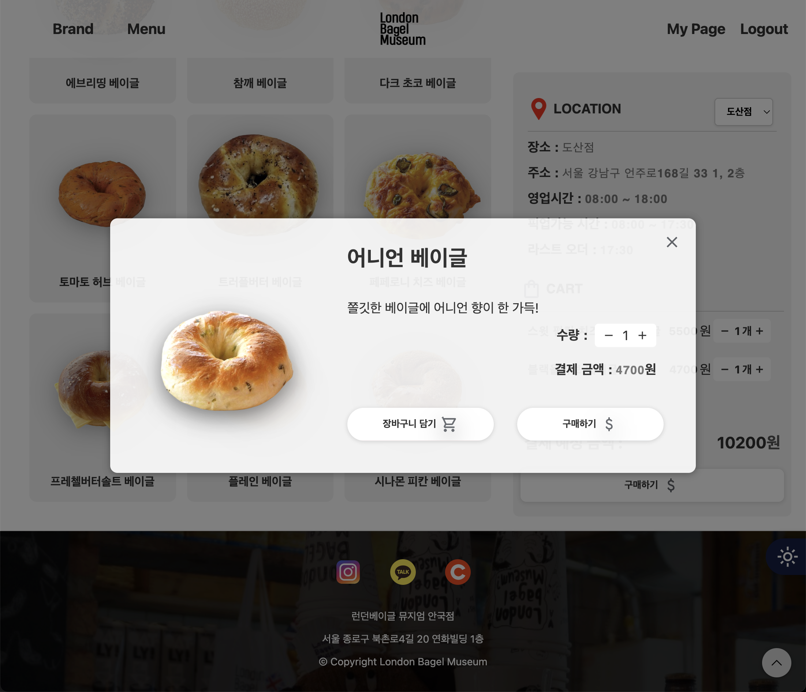
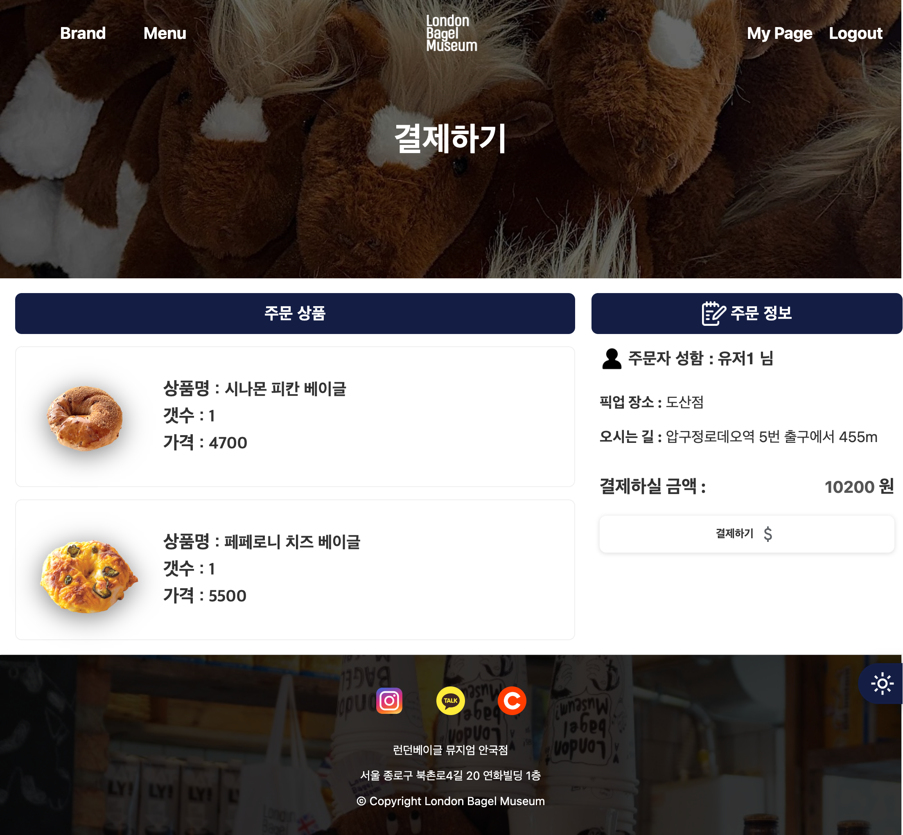
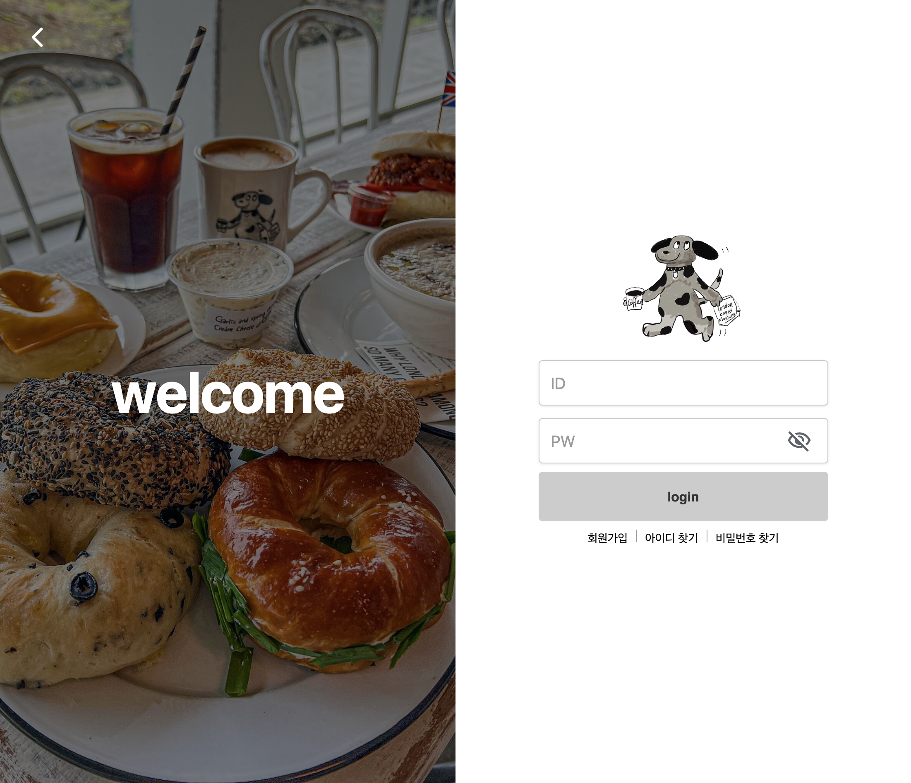
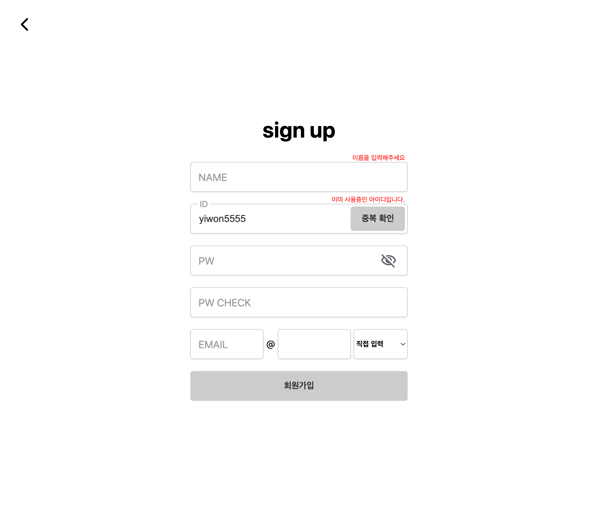

# 🥯 London Bagel Team Project  

    - 팀원 : 예이원, 정다운 
    - 개발 기간 : 2024.06.10 ~ 2024.07.03
    - 분류 : 팀 프로젝트
    - 배포 주소 : http://dldnjs1029.dothome.co.kr/

## 📌 목차
<b>

- [기획](#⚒️-기획)
- [본인 맡은 파트](#⚒️-본인-맡은-파트)
- [전체 페이지 구성](#📋-전체-페이지-구성)
  
</b>

# ⚒️ 기획   

### 💡 기획 의도 
    런던 베이글의 홈페이지가 없어 공식 웹사이트 제작하여 항상 긴 웨이팅으로 고객들이 불편함을 겪는 상황에서, 웨이팅을 피하고 집에서 간편하게 픽업 예약을 할 수 있는 기능을 제공하려하고자, 기획하게 됨

    - 사용 기술: HTML5, CSS3, JavaScript, JQUERY

   
 

# ⚒️ 본인 맡은 파트
    
### 🙌🏻
- 전체적인 디자인 및 css 담당 
- 메인 페이지 
- 카카오 API 사용하여 지점 별 위치 안내
- 로컬스토리지 활용한 로그인 기능 
- 회원 가입 유효성 검사 및 에러 메세지 
- 로컬스토리지 다크 모드
- 모바일 반응형

## 🎨 주색
    #FFF5E0, #C70039, #141E46

### 선택 이유 

    가게의 색상은 고풍스러운 감성을 살리기 위해
    따뜻한 #FFF5E0 크림색을 중간에 섞어
    아늑하고 편안한 분위기를 주기위해, 

    영국 국기가 들어가있는 컨셉에 맞춰  #C70039  #141E46 색상으로 고급스러운 영국 빵집에 온 느낌을 주려고 사용

 

# 📋 전체 페이지 구성 

## 메인 페이지

## 매장 위치 안내 

## 메뉴 페이지

## 메뉴 팝업 

## 결제 페이지

## 로그인 페이지 

## 회원가입 페이지 

